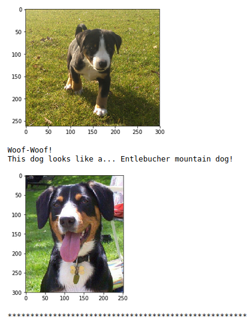
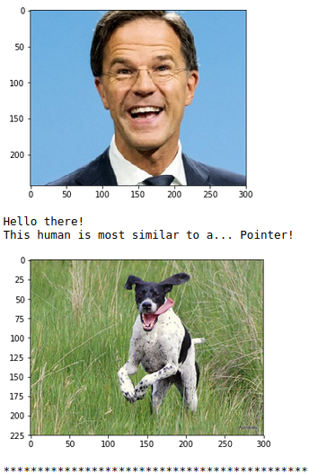

# Dog Breed Classifier

## Project description

This is a Capstone Project for the Udacity Machine Learning Nanodegree.

This project uses Convolutional Neural Networks (CNNs) to build a pipeline that 
processes real-world images and is able to:
1. Classify whether an image contains a human face, a dog or neither
2. If a dog is detected: estimate the dog’s breed
3. If a human face is detected: estimate the most-resembling dog breed

### Two examples 

Dog image             |  Human Image
:-------------------------:|:-------------------------:
 | 

## Requirements
Python 3.x
* jupyter
* matplotlib
* numpy
* opencv-python
* pillow
* tqdm
* pytorch 
* torchvision 
* cudatoolkit

## Startup Instructions

1. Clone the repository. 
Navigate to the folder.
    ```sh
    git clone https://github.com/j-zeg/project-dog-classification.git
    cd project-dog-classification
    ```
2. Download and unzip the datasets.
    ```sh
    sh datasets_downloader.sh
    ```
    Alternatively, download the datasets manually and store in the specified path in the repo: 
    * [Dog image dataset](https://s3-us-west-1.amazonaws.com/udacity-aind/dog-project/dogImages.zip) > `path/to/project-dog-classification/dogImages`

    The dogImages/ folder should contain 133 folders, each corresponding to a different dog breed.
    * [Human face dataset](http://vis-www.cs.umass.edu/lfw/lfw.tgz) > `path/to/project-dog-classification/lfw` 

    If you are using a Windows machine, you are encouraged to use 7zip to extract the folder.

3. Open `dog_app.ipynb` with Jupyter 
    ```sh
    jupyter notebook dog_app.ipynb
    ```

## Model description

The dog breed classifier is build using a CNN transfer learning approach:
* All layers but the last layer of a pre-trained VGG-16 model are used
* The pre-trained weights are frozen to avoid overfitting on our small dataset
* The last layer is a new linear layer which randomized weights are trained

Thanks to transfer learning, the dog breed classifier obtains 87% accuracy on our test set.

For comparison: our custom CNN build from scratch (without transfer learning) 
obtained 14% accuracy.


## License

The contents of this repository are covered under the [MIT License](LICENSE).
